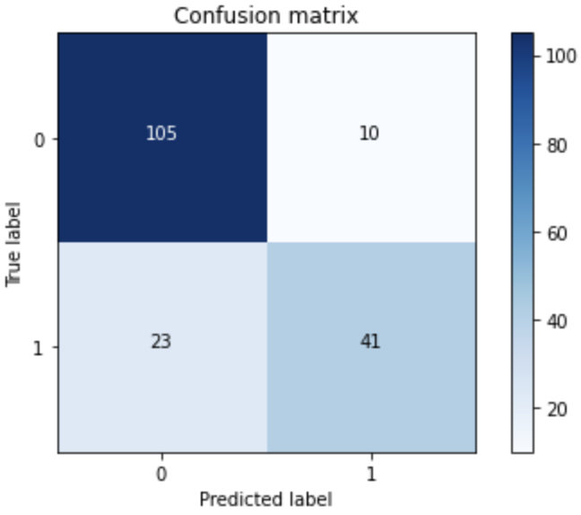
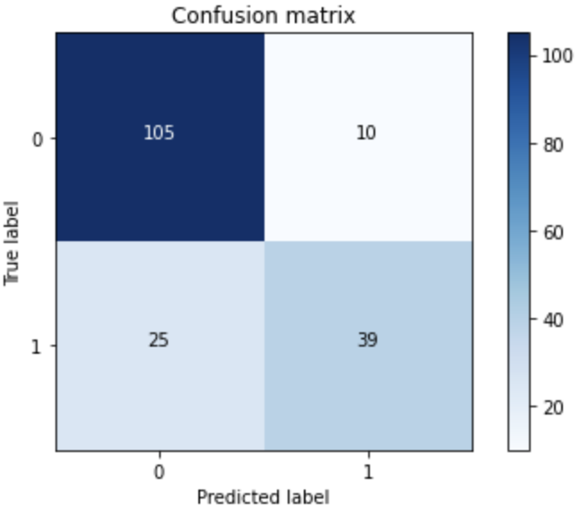
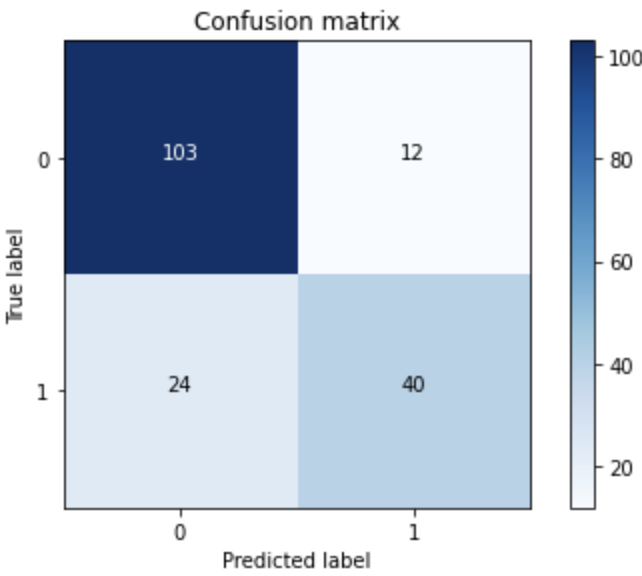
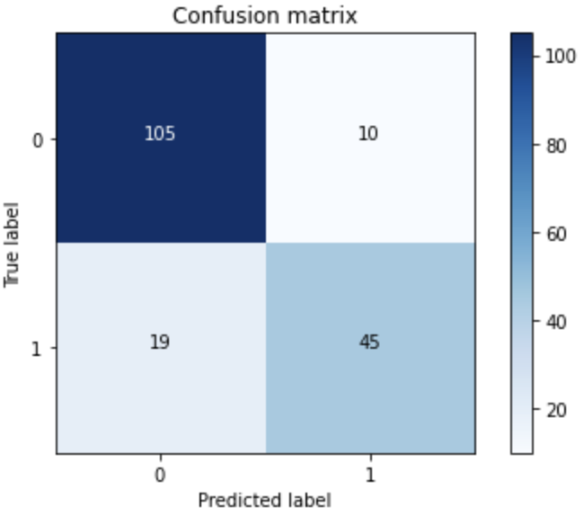

# Random Forest Classification
This project focuses on implementing a Decision Tree algorithm from scratch to predict Titanic survival outcomes based on various passenger features. Additionally, it explores enhancing model accuracy through Bagging techniques and Random Forests to achieve more robust classification performance.

We begin by preprocessing the dataset and selecting features that are likely to influence survival predictions. Initially, we set the decision tree's depth (the number of features used for prediction) to 3 and use this as a baseline.


We evaluate the model's performance by testing five different decision tree depths to observe their impact on accuracy and overfitting tendencies.

Depth = 3:


```
Accuracy = 82.68156424581005
```

Depth = 5:


```
Accuracy = 83.79888268156425
```

Depth = 7:



```
Accuracy = 81.56424581005587
```

Depth = 9:



```
Accuracy = 80.44692737430168
```

Depth = 11:



```
Accuracy = 79.88826815642457
```

As we see, at some depth the algorithm overfits, and the accuracy does not improve constantly.

Next we implement a random forest algorithm by defining the following function:


```python
def RandomForest(x_train, y_train, x_test, num_tree):
  y_pred = np.zeros((len(y_test),num_tree))
  for i in range (num_tree):
    new_tree = DecisionTree(max_depth = random.randint(3, 9))
    new_tree.fit(x_train,y_train)
    y_pred[:,i] = new_tree.predict(x_test)

  y_predicted = np.zeros(len(y_test))
  for i in range(len(x_test)):
    unique_vals, counts = np.unique(y_pred[i], return_counts = True)
    y_predicted[i] = unique_vals[np.argmax(counts)]
  return y_predicted
```

Testing with different number of trees:


For num_tree = 3:


```
Accuracy = 80.24022346368714
```

For num_tree = 5:


```
Accuracy = 81.56424581005587
```

For num_tree = 7:



```
Accuracy = 83.79888268156425
```

As we see, by increasing the number of trees, the accuracy improves, which is expected in the ensemble learning algorithms.
